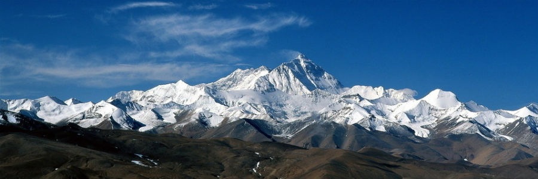

### Why everest?

This project aims to create a clone of [akka](http://akka.io). This project is for learning purpose,

As developer, we don't only want to know how to use it, we also want to understand the implementation, the design behind it.

Akka is a toolkit and runtime for building highly concurrent, distributed, and resilient message-driven applications on the JVM.

We'd like to understand what make it _highly concurrent_, _distributed_, _resilient_.

so let's create our own version of akka - **everest**

###Tasks
[ ] define requirements
[ ] everest-actor
